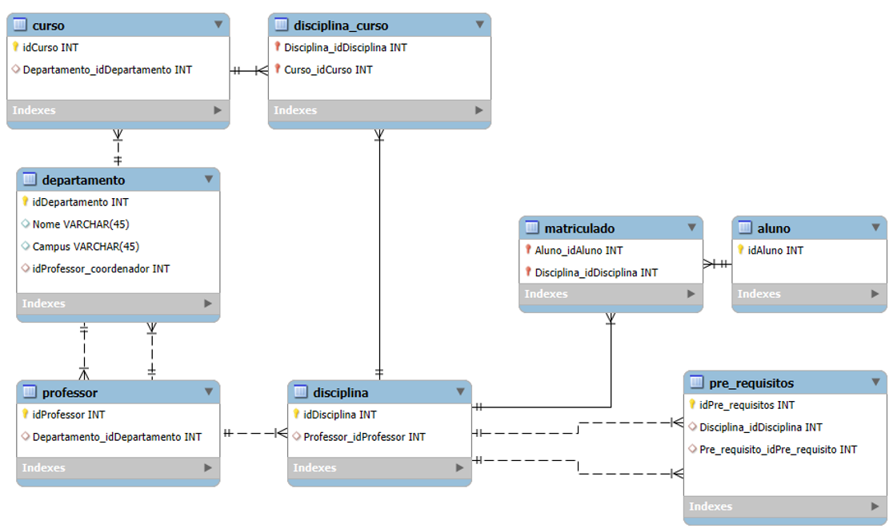
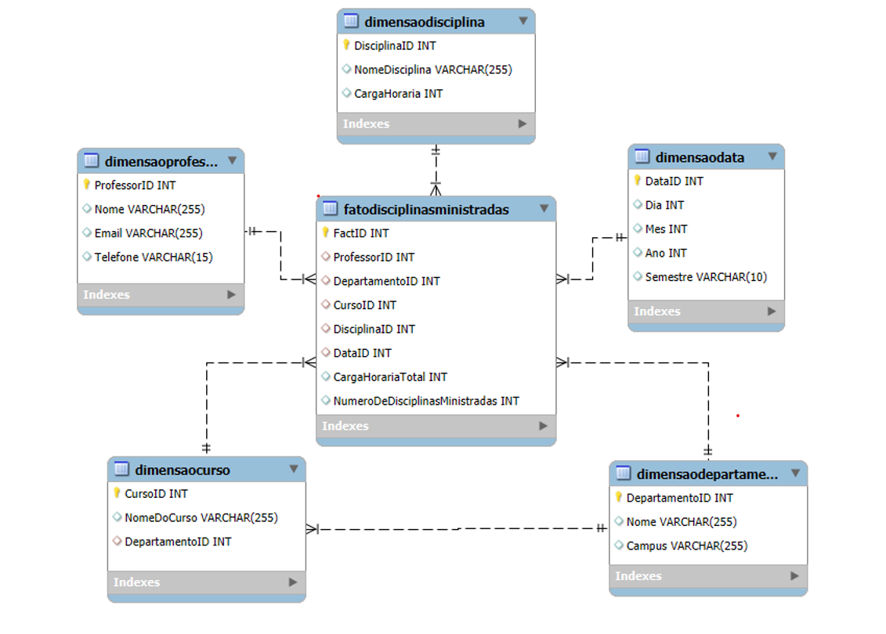

# Desafio DIO - Modelagem Dimensional

## Modelo Relacional

O modelo relacional abrange a gestão de cursos, departamentos, professores, disciplinas, alunos e suas interações através de matrículas e pré-requisitos de disciplinas.

### Descrição das Tabelas do Modelo Relacional:
- **Curso**: Informações sobre os cursos oferecidos, cada um vinculado a um departamento.
- **Departamento**: Detalha cada departamento, incluindo o professor coordenador.
- **Professor**: Informações sobre os professores, incluindo a afiliação ao departamento.
- **Disciplina**: Detalhes das disciplinas ofertadas e os professores responsáveis.
- **Disciplina_Curso**: Associa disciplinas a cursos, permitindo múltiplas associações.
- **Matriculado**: Registra quais alunos estão matriculados em quais disciplinas.
- **Aluno**: Contém dados dos alunos matriculados.
- **Pre_requisitos**: Define as dependências entre as disciplinas.

## Modelo Dimensional (Esquema em Estrela)

O modelo dimensional é utilizado para análises focadas em professores e suas atividades de ensino. Este modelo facilita a realização de consultas analíticas e a geração de relatórios.

### Descrição das Tabelas do Modelo Dimensional:
- **FatoDisciplinasMinistradas**: Centraliza dados sobre as disciplinas ministradas, incluindo métricas como carga horária total e número de disciplinas ministradas.
- **DimensaoProfessor**: Detalhes dos professores, proporcionando um filtro para análises por instrutor.
- **DimensaoCurso**: Informações sobre os cursos, útil para análises agrupadas por curso.
- **DimensaoDisciplina**: Armazena informações sobre as disciplinas, incluindo carga horária.
- **DimensaoData**: Detalhes temporais que permitem análises por períodos específicos.
- **DimensaoDepartamento**: Informações sobre os departamentos, essenciais para análises departamentais.
